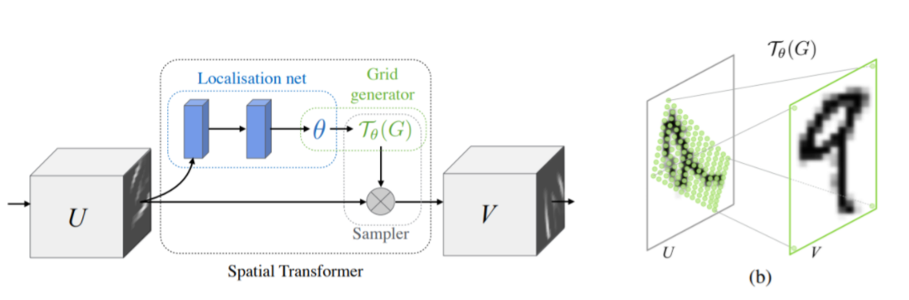
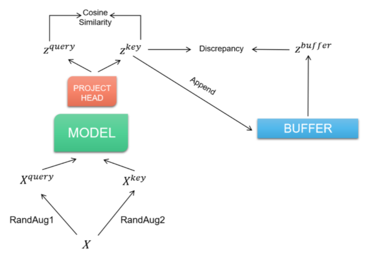
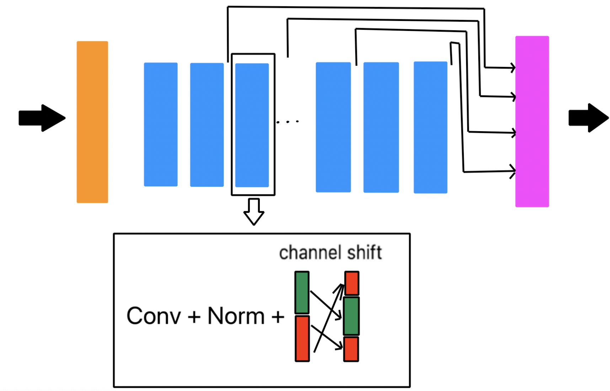
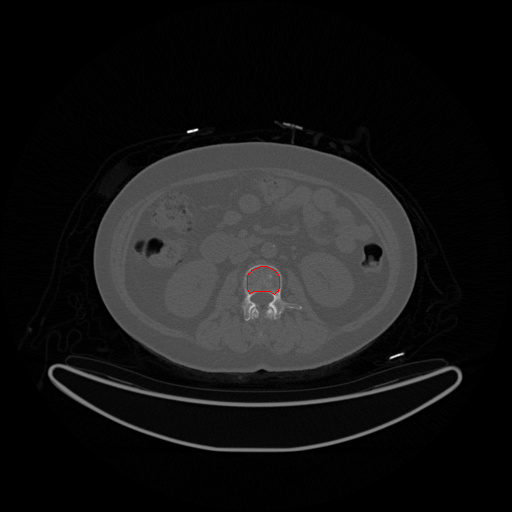
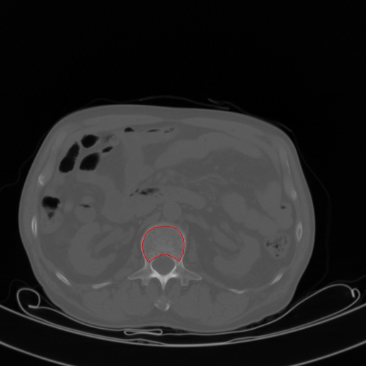
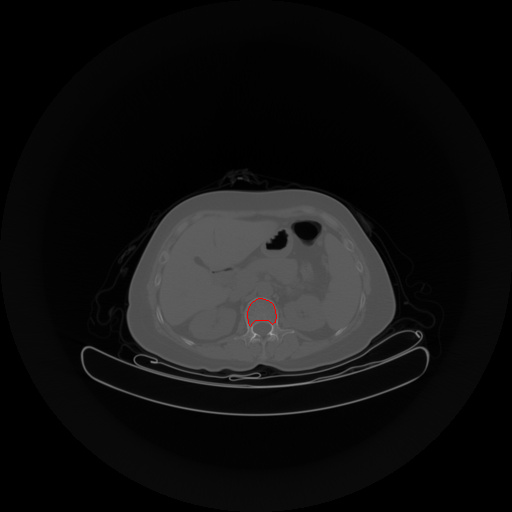
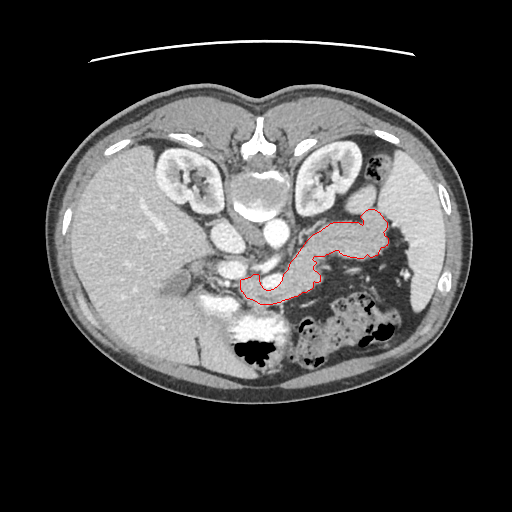

# THU模式识别2021春 -- Jittor 医学图像分割

## 模型列表
本仓库收录了课程作业中同学们采用jittor框架实现的如下模型：
- UNet
- SegNet
- DeepLab V2
- DANet
- EANet
- HarDNet及其改动HarDNet_alter
- PSPNet
- OCNet
- OCRNet
- DLinkNet
- AttentionUNet
- UNet++
- UNet+++
- DenseUNet
- TernausNet
- CSNet
- SCSENet
- U2Net
- U2Net-small(轻量化的U2Net)
- Multi-ResUNet
- R2 UNet
- R2 Attention UNet
- LightNet
- OneNet(轻量化的UNet)
- CENet
- LRF-EANet
- SimpleUNet
- SETR

## 课程同学提出的优秀方案

### 增加小模型的鲁棒性

  *成员：汪元标，黄翰，李响，郑勋*

  - Spatial Transformer Network（STN）

    通过对图片做自适应的仿射变换提高模型的鲁棒性
    
    

    其中Localization Network采用了多层卷积block的结构，输出通道数分别为8, 16, 32, 64，每个block包括一个3x3的二维卷积，BatchNorm层以及ReLU激活函数，最后经过一个Adaptive Average Pool层实现对多尺寸的支持，参见 `advance/stn.py`

  - 对比学习自监督预训练
    
    为了学习CT图像的Latent Feature，采用了对比学习的算法，使用了InfoNCE作为损失函数，采用Memory Bank来采样负例。

    

  - 数据增强

    采取了颜色空间的变换，包含亮度、对比度、色相、色调的随机变换。

  - 效果

    经过改动后的UNet有很好的鲁棒性。即使是智能手机拍摄的照片也可以很好地识别
    
    

  - demo
  
    - 参见[清华云盘链接](https://cloud.tsinghua.edu.cn/f/d6bbfa925b87400eb707/)

    - 用法

      ```shell
      > export FLASK_APP='app.py'
      > python -m flask run -p [PORT]
      ```

### 轻量化模型
*游嘉诚*

为了降低参数量，考虑使用组卷积（group conv），然而组卷积限制了通道之间的信息交流。传统channel shuffle 限制了各 group 信息交流的表达力，同时内存访问连续性差或MACS大。于是提出了领域通道平移（channel shift），即通道顺序平移0.5*group，保证各组只与邻域交流，也许可能使得关系密切的组也许会趋向聚在一起。网络开始使用$4\times4$卷积核和stride=4进行四倍下采样，最终使用转置卷积ConvTranspose进行4倍上采样。类似densenet思想，网络将特征图进行通道拼接后进行转置卷积上采样。

  

## 二、数据

### 腰椎骨松质分割数据集

协和医院和中山医院分别提供了腰椎数据集，经过同学们的标注，从协和数据集中划分出了训练集、验证集和测试集。

**协和数据集**选择并标注了腰椎3，腰椎4的CT片，其中：

- **训练集**：包含85人共计1442张腰椎CT片

- **验证集**：包含31人共计549张腰椎CT片

- **测试集**：包含36人共计615张腰椎CT片

下图展示了协和数据集的样例



**中山数据集**被用于测试模型的跨数据集泛化性能，中山数据集包含大图和小图两种类型，选择并标注了腰椎1，腰椎2的CT片。其中：

- **大图**：包含134人共计858张腰椎CT片

- **小图**：包含134人共计868张腰椎CT片

下图分别是中山数据集的大图和小图样例





### 胰腺分割数据集

胰腺分割数据集包含

- **训练集**：包含8人共计1720张CT片

- **验证集**：包含2人共计424张CT片

- **测试集**：包含2人共计401张CT片




### 下载地址
[清华云盘](https://cloud.tsinghua.edu.cn/f/7be467b07b6f4ffe8a55/) 数据下载成功后将压缩包解压为 `./data` 文件夹即可。


## 运行方法

1. 配置相应环境，安装[Jittor](https://github.com/Jittor/jittor)最新版本

2. 下载数据集

3. 下载一些模型必须的[ImageNet预训练权重](https://cloud.tsinghua.edu.cn/f/f299d34ed5fb4022a88c/?dl=1)，并解压至`model/`目录下.

4. 如想要使用训练好的模型参数，可在[这里](https://cloud.tsinghua.edu.cn/d/e04275bb8248461a8898/)下载胰腺数据上训练完成的模型参数，也可以先下载[可视化结果](https://cloud.tsinghua.edu.cn/d/71b56f28905149a5a610/)先观察模型效果。

4. 运行训练/测试/可视化

```
usage: run.py [-h]
              [--model {unet,hrnet,setr,unet3p,segnet,hardnet,deeplab,pspnet,danet,eanet,ocrnet,resunet,ocnet,attunet,dense,dlink,ternaus,scseunet,r2,r2att,csnet,unetpp,unetppbig,multires,u2net,u2netp,onenet,lightnet,cenet,setr,hardalter,lrfea,simple}]
              [--pretrain] [--checkpoint CHECKPOINT] --dataset
              {xh,xh_hard,zs_big,zs_small,pancreas} --mode
              {train,test,predict,debug} [--load LOAD] [--aug] [--cuda]
              [--stn] [-o {Adam,SGD}] [-e EPOCHS] [-b BATCH_SIZE] [-l LR]
              [-c CLASS_NUM] [--loss LOSS] [-w BCE_WEIGHT] [-r RESULT_DIR]
              [--poly]

optional arguments:
  -h, --help            show this help message and exit
  --model {unet,hrnet,setr,unet3p,segnet,hardnet,deeplab,pspnet,danet,eanet,ocrnet,resunet,ocnet,attunet,dense,dlink,ternaus,scseunet,r2,r2att,csnet,unetpp,unetppbig,multires,u2net,u2netp,onenet,lightnet,cenet,setr,hardalter,lrfea,simple}
                        choose the model
  --pretrain            whether to use pretrained weights
  --checkpoint CHECKPOINT
                        the location of the pretrained weights
  --dataset {xh,xh_hard,zs_big,zs_small,pancreas}
                        choose a dataset
  --mode {train,test,predict,debug}
                        select a mode
  --load LOAD           the location of the model weights for testing
  --aug                 whether to use color augmentation
  --cuda                whether to use CUDA acceleration
  --stn                 whether to use spatial transformer network
  -o {Adam,SGD}, --optimizer {Adam,SGD}
                        select an optimizer
  -e EPOCHS, --epochs EPOCHS
                        num of training epochs
  -b BATCH_SIZE, --batch-size BATCH_SIZE
                        batch size for training
  -l LR, --learning-rate LR
                        learning rate
  -c CLASS_NUM, --class-num CLASS_NUM
                        pixel-wise classes
  --loss LOSS           Choose from 'ce', 'iou', 'dice', 'focal', if CE loss
                        is selected, you should use a `weight` parameter
  -w BCE_WEIGHT         use this weight if BCE loss is selected; if w is
                        given, then the weights for positive and negative
                        classes will be w and 2.0 - w respectively
  -r RESULT_DIR, --resultdir RESULT_DIR
                        test result output directory
  --poly                whether to use polynomial learning rate scheduler
```

5. 运行对比学习预训练

```
usage: run_ssl.py [-h]
                  [--model {unet,hrnet,setr,unet3p,segnet,hardnet,deeplab,pspnet,danet,eanet,ocrnet,resunet,ocnet,attunet,dense,dlink,ternaus,scseunet,r2,r2att,csnet,unetpp,unetppbig,multires,u2net,u2netp,onenet,lightnet,cenet,setr,hardalter,lrfea,simple}]
                  --dataset {xh,xh_hard,zs_big,zs_small,pancreas}
                  [--save SAVE] [-e EPOCHS] [-c CLASS_NUM] [-b BATCH_SIZE]
                  [--channel EMBEDDING_CHANNEL] [--layer LAYER] [--lr LR]
                  [--pretrain]

optional arguments:
  -h, --help            show this help message and exit
  --model {unet,hrnet,setr,unet3p,segnet,hardnet,deeplab,pspnet,danet,eanet,ocrnet,resunet,ocnet,attunet,dense,dlink,ternaus,scseunet,r2,r2att,csnet,unetpp,unetppbig,multires,u2net,u2netp,onenet,lightnet,cenet,setr,hardalter,lrfea,simple}
                        choose a model network
  --dataset {xh,xh_hard,zs_big,zs_small,pancreas}
                        select a dataset
  --save SAVE           model weights save path
  -e EPOCHS, --epochs EPOCHS
                        number of training epochs
  -c CLASS_NUM, --class-num CLASS_NUM
                        class number
  -b BATCH_SIZE, --batch-size BATCH_SIZE
                        training batch size
  --channel EMBEDDING_CHANNEL
                        number of channels of embedded feature maps
  --layer LAYER         layer to extract features from
  --lr LR               learning rate
  --pretrain
```

**运行示例**
参见`train.sh`, `batch_test.sh`, `pretrain.sh`


## 四、实验结果
### 胰腺分割数据集
各模型均采用相同超参数，学习率$3\times10^{-4}$，迭代次数50次，以权重为[0.8, 0.2]的交叉熵损失函数进行训练，参见`train.sh`中dataset为pancreas的部分。结果如下:

| Model   | Dice   | mIoU   |
|---------|--------|--------|
| UNet    | 0.7292 | 0.6477 |
| SegNet  | 0.6291 | 0.5726 |
| DeepLab | 0.8306 | 0.7467 |
| DANet   | 0.7787 | 0.6928 |
| EANet   | 0.6753 | 0.6055 |
| HarDNet | 0.7491 | 0.6654 |
| HarDNet_alter | 0.7779 | 0.6920 |
| PSPNet  | 0.7772 | 0.6914 |
| OCNet   | 0.7789 | 0.6930 |
| OCRNet  | 0.7034 | 0.6272 |
| DLinkNet | 0.4995 | 0.4989 |
| AttentionUNet | 0.7691 | 0.6836 |
| UNet++  | 0.8282 | 0.7439 |
| UNet+++ | 0.7892 | 0.7030 |
| DenseUNet | 0.8053 | 0.7194 |
| TernausNet | 0.6752 | 0.6055 |
| CSNet   | 0.4994 | 0.4989 |
| SCSENet | 0.4994 | 0.4989 |
| U2Net   | 0.8143 | 0.7289 |
| U2Net-Small | 0.8338 | 0.7502 |
| Multi-ResUnet | 0.7230 | 0.6427 |
| R2UNet  | 0.8289 | 0.7447 |
| R2AttentionUNet | 0.8084 | 0.7227 |
| LightNet | 0.8006 | 0.7145 |
| OneNet  | 0.7754 | 0.6896 |
| CENet   | 0.7583 | 0.6735 |
| LRF-EANet | 0.6942 | 0.6197 |
| SimpleUNet | 0.7395 | 0.6569 |
| SETR    | 0.4994 | 0.4989 |
| UNet-SSL | 0.8026 | 0.7165 |
| UNet-STN-SSL | 0.7926 | 0.7063 |
| UNet-Aug-STN-SSL | 0.6938 | 0.6192 |


### 腰椎骨松质分割数据集

  1. 协和数据集

      下表展示了三种模型使用不同损失函数及加权组合的结果

      | mIoU | CE | IoU | Dice | Focal | 0.8CE+0.2IoU | 0.5CE+0.5IoU | 0.2CE+0.8IoU | 0.5CE+0.5Dice |
      | - | - | - | - | - | - | - | - | - |
      | UNet  | 95.49 | 95.56 | 95.41 | 95.43 | 95.48 | 95.25 | 95.42 | 95.17 |
      | HRnet | 95.22 | 95.23 | N/A | N/A | — | — | — | — |
      | SETR  | 87.59 | 87.81 | 85.92 | 83.85 | 88.34 | 83.94 | 87.52 | 87.78 |

  2. 中山数据集

      下表记录了协和数据集上训练的OneNet模型在中山数据集上的表现

